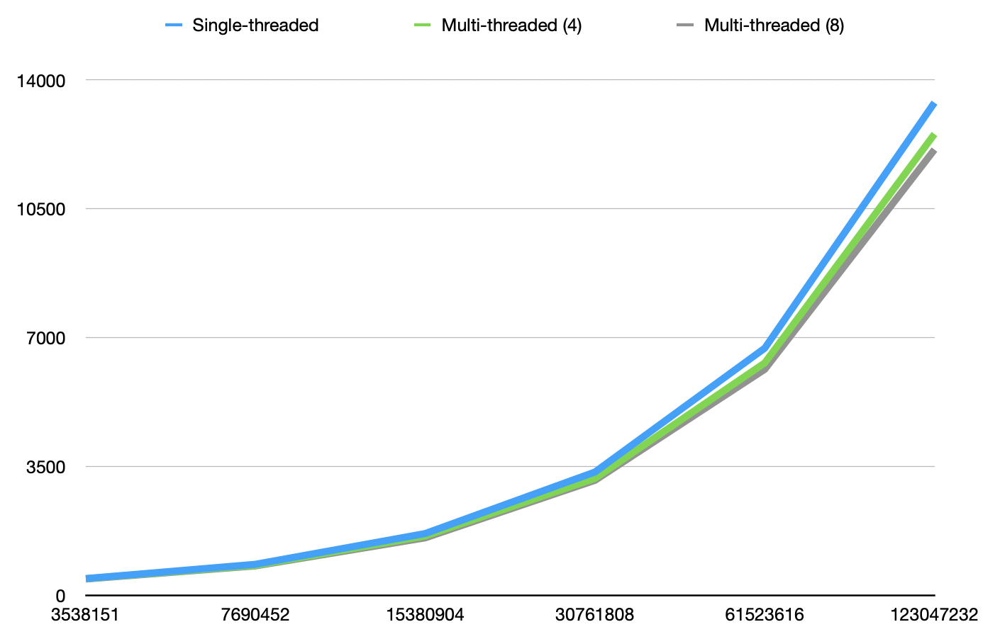

# Books & maps

The classic data structures and algorithms problem: having a text file (a book), count the number of unique words in the book with their frequencies and report the top 100 most often used words in the book in descending order.

Here we are not interested in which data structure to use to solve the problem. The goal of these two implementations is to compare the speed differences of a *multi-threaded* implementation to a *single-threaded* implementation. Can threads be used to improve the performance of counting the unique words, using the C++ standard library `std::map`?

---

This classic problem is often given to students to learn how to implement this using one of the basic data structures, such as a hash table or binary search tree.

This project contains two implementations of this problem. In both implementations C++ Standard Library `std::map` (a dictionary of key-value pairs) is used. Key is the unique words in a book, while value is the count of the word in the book.

However, the project also shows that using the (perhaps familiar) `std::map` by default may not always be the best choice. Especially when time performance is important. Since there is an option, maybe a better one, as we will see in the end...

## Requirements for building and running

The code here requires C++ v17 and [Boost](https://www.boost.org) version 1.76 or higher. Boost is used in splitting the ignore file strings using comma and end of line chars with `boost::split`.
 
 Projects are described using [CMake](https://cmake.org) so any IDE which can import projects from CMake can be used to import them to the IDE. Building from command line is described below.
 

## Single-threaded implementation

The single-threaded implementation can be found in the subdirectory [books](books).

The logic is simple. The program will:

1. first check the program arguments: first argument is the book file, name, second is the words to ignore file name and the third one is the number of top words to print, e.g. 100,
1. then do some preparations; makes sure the program can handle UTF-8 encoded strings, and initiates measuring the performance in time,
1. next the words to be ignored is read from a text file. Ignored words must be separated by commas and/or end of line chars,
1. after this the book file is read, line by line. When processing each line, word breaks are identified by characters by calling `std::isalpha` -- returning false indicates a word break. Then the chars of the word are converted to lowercase and if the length of the word is two characters or more, it is added to a `std::map` with a frequency count. If the word is already in the map, the frequency count is increased by one,
1. after the book file has been handled, the word-frequency pairs from the map are moved into a map of frequency-word map. This is needed since it is not possible to sort word-frequency map by frequency. You can sort a map only by the key value. In the frequency-word map the sorting by the frequency key is possible.
1. as the sorting the frequencies in descending order has been finished, it is possible to print the top list of words by frequency,
1. and finally also the time performance is printed out, together with some summary counters from counting the words.

You can build the code using the provided [CMake](https://cmake.org) file `CMakeLists.txt` and [Ninja](https://ninja-build.org) build tool:

```console
mkdir ninja && cd ninja
cmake -GNinja -DCMAKE_BUILD_TYPE=Release ..
ninja
```

And then execute the app to print top-100 list of words with frequencies:

```console
./books <path-to-book-file.txt> <path-to-ignore-file.txt> 100
```

The project contains `do-ninja.sh` for building for command line using Ninja, and `go.sh` for executing the app using provided sample files in `sample` directory.
 
> Note that Ninja build was created with `Release` configuration. When measuring execution speed release should be the selected configuration since debug configurations are usually slower and do not reflect the real time performance in production code.


## Multi-threaded implementation

The multi-threaded implementation can be found in the `books-threads` subdirectory.

The logic is mostly the same than in the single-threaded implementation. There are some differences though.

* To enable parallel counting of words, all the words in the book are first read into a `std::vector` of strings.
* The array is then "sliced" into eight parts, to be processed by eight threads, in parallel. No actual slicing is done to separate string containers, though, but each thread just handles the area of the array pointed to the thread.
* Thus each slice is a slice of the original vector of strings, described by startIndex-endIndex.
* A struct `thread_struct` is created for each thread, having a constant reference to the original vector as well as to the words-to-ignore vector, and the start and end indices to process. 
* The references to the original data are const since we do not want the threads to change the original data in any way during the processing. Since the original data cannot be changed, and the threads will each process their own slice of the original data, we do not need any thread locking facilities to control acccess to the shared data. This lack of possibility to manipulate shared of data and thus lack of locks makes the processing faster.
* The `thread_struct` will also contain writeable map of word-frequency pairs to calculate the word frequencies from the thread's *own slice* of the array of all words. Additionally, the `thread_struct` will have counter variables to count statistics of the processing.

So, instead of reading the book data line to line and processing all the lines linearly in a single thread, this implementation will 

1. read all words into a shared vector and then,
1. prepare eight `thread_struct`s for each of the eight threads to process and,
1. launch the eight threads which will then calculate the word frequencies from their own slices,
1. main thread waits for the threads to finish using `std::thread.join()`,  
1. main thread will then combine the total result from the eight partial results created by the threads, and
1. move the word-frequency pairs into a frequency-word map for sorting (as in single-threaded implementation),
1. finally, print out the final result, time performance and statistics from the word counting.

You can again build the code using the provided [CMake](https://cmake.org) file `CMakeLists.txt` and [Ninja](https://ninja-build.org) build tool:

```console
mkdir ninja && cd ninja
cmake -GNinja -DCMAKE_BUILD_TYPE=Release ..
ninja
```

And then execute the app to print top-100 list of words with frequencies:

```console
./books <path-to-book-file.txt> <path-to-ignore-file.txt> 100
```

You may use the provided `do-ninja.sh` and `go.sh` for building and executing the app.

## Comparisons

Speed comparisons below have been measured using builds with Release configurations in a Apple Mac Mini M1 2020 with 16GB of RAM, SSD disk, macOS Monterey 12.4. Compiler used was AppleClang 13.1.6.13160021

Test file was a book file with 17 069 578 bytes of data, having 3 538 151 words, of which 2 293 709 were counted as words to include in the frequency count, while 1 244 442 words were ignored. There was 42 words to ignore in the ignore file. The book file has 9 6205 unique words in total.

The table below shows typical execution times.

| Implementation     | Time performance (ms)  |
|--------------------|-----------------------:|
| single-threaded map|                   665  |
| multi-threaded map |                   491  |

Using threads leads to an execution time 74% of the single threaded implementation. An expected and understandable improvement.

Should we be happy? Consider threading a good solution, improved the performance and rewarding ourselves with a pint?

## Mind the map

When implementing the threaded solution, I happened to stop by to read the documentation at [cppreference.com](https://en.cppreference.com/w/cpp/container/map) says:

> "std::map is a sorted associative container that contains key-value pairs with unique keys. **Keys are sorted** by using the comparison function Compare."

Note the part "...keys are sorted..." (emphasis mine). When adding the unique words to the map, the dictionary is sorted after each word is added to the dictionary. **That takes time**. Since we are not even interested about the words being in order, this is unnecessary. Can we avoid this? Does this have a significant impact on the time performance? 

Fortunately, there is a dictionary in `std` that does not sort. Let's test how `std::unordered_map` performs against `std::map`. More information on unordered map at [cppreference.com](https://en.cppreference.com/w/cpp/container/unordered_map).

The code already contains both maps, the other one commented out. Try out both versions to verify, commenting the other. My tests with both maps gave the following results:

| Implementation                | Time performance (ms) |
|-------------------------------|----------------------:|
| single-threaded map           |                   665 |
| single-threaded unordered map |                   446 |
| multi-threaded map            |                   491 |
| multi-threaded unordered map  |                   434 |

Based on these tests, implementing multi-threaded `std::map` version to boost time performance was a wasted effort! Single-threaded unordered map was *faster* than threaded map implementation. Just taking away the unnecessary sorting to keep the keys (unique words in the book) in order made the unordered map version faster.

You can also see that combining both threading and unordered maps does not provide any time performance advantage, being only 12 ms faster than the single-threaded version.

## Conclusion

What to learn from this?

Mind the map. Know the available data structures. Read the documentation.

Consider the needs of the task and pick the data structure fulfilling the needs, *without unnecessary work being done*. In this case `std::unordered_map` is more suitable solution than using the more familiar and easier to type `std::map`. Using a fast data structure may save you from complicated threaded code that you may not even need to implement.

## Addendum

So why the multithreaded version is not faster? And do both of the solutions **scale** when n (number of words in a book file) grows?

I tested this. The first line in the table below is the test file `Bulk.txt` used above. The other files are that test file concatenated again and again, always doubling the file size from the previous one.

I tested the single and multithreaded implementations (with four and eight threads) to see how they compare.

| Words in file	| Single-threaded	| Multi-threaded (4)	| Multi-threaded (8)	| 8 / single thread  |
|----------------:|----------------:|-------------------:|-------------------:|-------------------:|
|   3 538 151     |             454 |                452 |                442 |               97% :|
|   7 690 452     |             843 |                814 |                799 |               95% :|
|  15 380 904     |            1678 |               1611 |               1561 |               93% :|
|  30 761 808     |            3349 |               3176 |               3123 |               93% :|
|  61 523 616     |            6712 |               6312 |               6138 |               91% :|
| 123 047 232     |           13382 |              12529 |              12106 |               90% :|

You can see that as the file size grows, the multithreaded version gets faster compared to the single threaded one. The last file which is 32 times larger than the original one, with 521MB of data, is handled 90% of the execution time with eight threads, compared to single-threaded version. Advantage is then 1.276 seconds.



The reason for the relatively small advantage of the threads is, as usual, **the I/O**. When measuring the phases of the multithreaded version you can see this clearly:

```console
Files read in          10278 ms.
Threads executed in     1715 ms.
Results merged in        100 ms.
Multimapped in            11 ms.
```

Most of the time is spent in reading the book files in memory. The advantage of the threads appear when the amount of data grows to be releatively significant.

## About

* &copy; Antti Juustila, 2022
* MIT License
* INTERACT Research Unit, Faculty of Information Technology and Electrical Engineering, University of Oulu, Finland.
 
